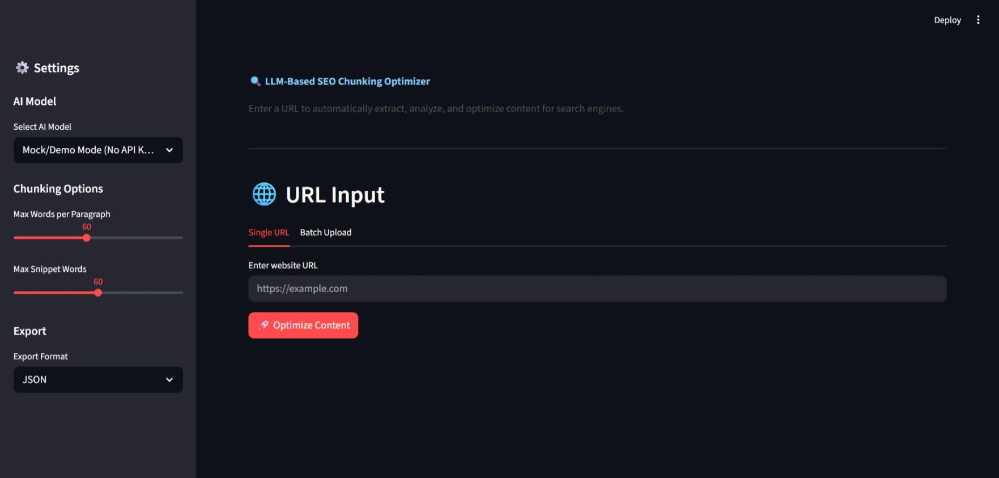

#  LLM-Based SEO Chunking Optimizer

An intelligent system that automatically extracts webpage content, analyzes SEO issues, and restructures content using AI to improve search engine rankings.

---

---

##  Features

- **URL Input System**: Single or batch URL processing
- **Web Scraping**: Extracts H1, H2, paragraphs, lists while removing ads and navigation
- **AI Content Optimization**: Uses GPT-4o or Gemini to rewrite and optimize content
- **SEO Chunking Engine**: Breaks content into snippet-ready blocks
- **Featured Snippet Generator**: Creates 40-60 word answers, bullet lists, and step-by-step guides
- **People Also Ask (PAA) Generator**: Auto-generates FAQ sections
- **Keyword Optimization**: Extracts and suggests keywords with density analysis
- **Internal Linking Suggestions**: Recommends link structure improvements
- **SEO Analysis Report**: Comprehensive scoring with actionable recommendations
- **Bulk Processing**: Process 100-1000 URLs and export results

##  Quick Start

### Prerequisites

- Python 3.8+
- pip

### Installation

1. Clone or download this repository
2. Navigate to the project root (`seo-url-optimizer/`)
3. Install dependencies:

```bash
cd seo-url-optimizer
pip install -r requirements.txt
```

4.  Set up API keys for AI features(Optional):

```bash
# For OpenAI
export OPENAI_API_KEY="your-key-here"

# For Google Gemini
export GEMINI_API_KEY="your-key-here"
```

> **Note**: The system works in **Demo Mode** without API keys, using built-in text optimization.

##  Usage

### Command Line

**Single URL:**
```bash
python main.py --url https://example.com
python main.py --url https://example.com
```

**Batch Processing:**
```bash
cd src
python main.py --batch ../data/urls.csv
```

### Streamlit Web App

```bash
cd frontend
streamlit run app.py
```

Then open your browser at `http://localhost:8501`

##  Project Structure

```
seo-url-optimizer/
│
├── src/
│   ├── main.py                    # Main orchestrator
│   ├── scraper.py                 # Web scraping module
│   ├── cleaner.py                 # Content cleaning
│   │
│   ├── chunking/
│   │   ├── seo_chunk.py           # SEO-focused chunking
│   │   ├── question_chunk.py      # Question-based chunking (PAA/FAQ)
│   │   └── topic_chunk.py         # Topic-based chunking
│   │
│   ├── ai/
│   │   ├── rewriter.py            # AI content rewriter (GPT-4o / Gemini)
│   │   └── snippet_generator.py   # Featured snippet generator
│   │
│   ├── seo/
│   │   ├── keyword.py             # Keyword extraction & density
│   │   ├── readability.py         # Readability scoring
│   │   └── linking.py             # Internal linking suggestions
│   │
│   ├── analyzer/
│   │   └── seo_score.py           # SEO report generator
│   │
│   └── utils/
│       └── helpers.py             # Utility functions
│
├── frontend/
│   └── app.py                     # Streamlit web UI
│
├── data/
│   └── urls.csv                   # Sample batch input
│
├── configs/
│   └── settings.json              # Configuration
│
├── output/
│   ├── optimized_content/         # Optimized content output
│   └── reports/                   # SEO analysis reports
│
├── requirements.txt
└── README.md
```

##  SEO Metrics

The system calculates:

| Metric | Description |
|--------|-------------|
| **Flesch Reading Ease** | How easy the text is to read (higher is better) |
| **Flesch-Kincaid Grade** | US school grade level required to understand |
| **Keyword Density** | Percentage of keyword usage in content |
| **Snippet Readiness** | Score indicating featured snippet potential |
| **Heading Structure** | Evaluation of H1/H2/H3 hierarchy |
| **Overall SEO Score** | Composite score out of 100 |

##  Example Transformation

**Before:**
```
Search Engine Optimization is a very important aspect of digital marketing that involves many different strategies and techniques to improve the visibility of a website in search engine results pages...
```

**After:**
```
## What is SEO?

SEO (Search Engine Optimization) is the process of improving website visibility in search engines.

### Key Benefits:
- Increased organic traffic
- Better search rankings
- Improved user experience
- Higher conversion rates
```

##  Configuration

Edit `configs/settings.json` to customize:

- `chunking.max_paragraph_words`: Target words per paragraph
- `seo.target_keyword_density`: Ideal keyword density %
- `ai.default_model`: Preferred AI model
- `output.export_formats`: Available export formats

##  API Keys

| Provider | Environment Variable | Model Name |
|----------|---------------------|------------|
| OpenAI | `OPENAI_API_KEY` | `gpt-4o` |
| Google | `GEMINI_API_KEY` | `gemini-pro` |

##  Technologies

- **Python 3.8+**
- **BeautifulSoup4** - HTML parsing
- **Requests** - HTTP requests
- **Streamlit** - Web interface
- **OpenAI API** - GPT-4o integration
- **Google Generative AI** - Gemini integration
- **NLTK** - Natural language processing

